  

  

## 🚀 About Me
- 🏦 Machine Learning Engineer at **Meta** 
- 🔥 **PyTorch Core Team** member
- 🏐 Former **Division I NCAA Volleyball** player

  

| **AI/ML** | **Systems** | **Web** | **Sports** |
|-----------|-------------|---------|------------|
|  |  |  |  |
|  |  |  |

## 🤝 Let's Connect!

  

